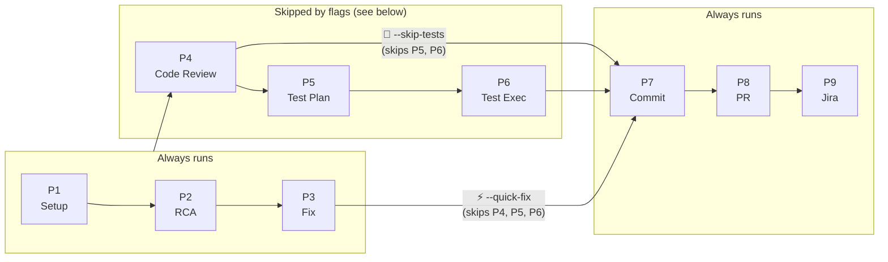
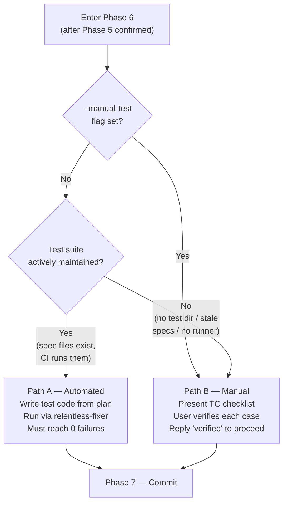

# 360 Ticket Resolver — Workflow

A developer-facing reference for understanding exactly what the skill does, what decisions it makes, and what you need to provide at each gate. Read this instead of SKILL.md when you want the "what happens when" view.

---

## Top-Level Flow

### Diagram 1 — Phase pipeline

Three groups of phases. Flags short-circuit at different points, jumping directly to Phase 7.



### Diagram 2 — Phase 6 internal branch

How Phase 6 decides between automated and manual testing.



---

## Argument Parsing and Mode Branching

### Parsing rules

```
/360-ticket-resolver <JIRA_TICKET> <WORK_BRANCH> [SOURCE_BRANCH] [flags...]
```

| Token | How it is identified | Required? |
|---|---|---|
| `JIRA_TICKET` | First word | Yes — ask inline if missing |
| `WORK_BRANCH` | Second word | Yes — ask inline if missing; must contain ticket ID as substring |
| `SOURCE_BRANCH` | Third word (only if it is not a flag) | No — defaults to current git branch |
| `--quick-fix` | Anywhere in args | No |
| `--skip-tests` | Anywhere in args (ignored when `--quick-fix` present) | No |
| `--manual-test` | Anywhere in args (ignored when `--quick-fix` or `--skip-tests` present) | No |

### Mode decision tree

```
Was --quick-fix provided?
├── YES  →  QUICK_MODE = true
│           Skip Phase 4 (code review), Phase 5 (test plan), Phase 6 (test execution)
│           Run: Phase 1, 2, 3, 7, 8, 9
│           PR/Jira comment marked "⚡ Quick Fix"
│
└── NO   →  Was --skip-tests provided?
            ├── YES  →  SKIP_TESTS = true
            │           Skip Phase 5 (test plan), Phase 6 (test execution)
            │           Run: Phase 1, 2, 3, 4, 7, 8, 9
            │           PR/Jira comment marked "🚫 Tests Skipped"
            │
            └── NO   →  Was --manual-test provided?
                        ├── YES  →  MANUAL_TEST = true
                        │           Run all phases 1–9
                        │           Phase 6 skips maturity check, goes directly to Path B
                        │           PR/Jira comment marked "🖐 Manually Tested"
                        │
                        └── NO   →  Standard mode
                                    Run all phases 1–9
                                    Phase 6 decides Path A vs Path B via maturity check
```

### Phase coverage by mode

| Phase | Standard | --quick-fix | --skip-tests | --manual-test |
|---|---|---|---|---|
| 1 Setup | Run | Run | Run | Run |
| 2 RCA | Run | Run | Run | Run |
| 3 Code Changes | Run | Run | Run | Run |
| 4 Code Review | Run | **Skip** | Run | Run |
| 5 Test Plan | Run | **Skip** | **Skip** | Run |
| 6 Test Execution | Path A or B | **Skip** | **Skip** | **Path B only** |
| 7 Check-in | Run | Run | Run | Run |
| 8 PR (optional) | Run | Run | Run | Run |
| 9 Jira Update | Run | Run | Run | Run |

---

## Per-Phase Detail

### Phase 1 — Setup

**Inputs needed:** `JIRA_TICKET`, `WORK_BRANCH`, `SOURCE_BRANCH` (or auto-detect)

**Output artifact:** Work branch created and synced, ready for code changes

```
1.1 Validate inputs
    ├── JIRA_TICKET blank?         → ask inline, wait, retry
    └── WORK_BRANCH missing ticket ID in name?
                                   → ask inline, wait, update, continue

1.2 Verify Jira ticket exists
    ├── HTTP 404                   → ask for correct ticket ID, retry
    ├── HTTP 401/403               → ask to fix ATLASSIAN_API_TOKEN, retry
    ├── Config error               → show error, ask to fix config.yml, retry
    └── Success                    → extract ticket details, proceed

1.3 Verify Bitbucket project exists
    ├── HTTP 404                   → ask to fix config.yml workspace/slug, retry
    ├── HTTP 401/403               → ask to fix token permissions, retry
    └── Success                    → connection confirmed, proceed

1.4 Determine and validate source branch
    ├── SOURCE_BRANCH provided?    → use it
    └── Not provided               → detect current branch with git
    Verify branch exists on remote:
    └── Not found on remote        → list available branches, ask inline, wait, update

1.5 Sync source branch
    Check git status:
    ├── Uncommitted changes AND unrelated to ticket
    │   → ask: keep / stash / commit / discard
    │   └── discard                → require "confirm-discard" before proceeding
    └── Changes clearly related to ticket
        → assume "keep" automatically, state inline, proceed
    git checkout SOURCE_BRANCH → git fetch origin → git merge origin/SOURCE_BRANCH
    └── Merge conflicts            → show conflicting files, wait for "resolved", verify, continue

1.6 Create work branch
    git checkout -b WORK_BRANCH
    ├── Already on WORK_BRANCH     → state it inline, proceed (no question)
    ├── Branch exists, on different branch
    │   → ask: "use-existing" or new branch name
    │   └── Never offer "abort"
    └── Created fresh              → proceed
```

**Failure behavior:** Every failure asks inline and waits. Nothing terminates.

---

### Phase 2 — Iterative RCA

**Inputs needed:** Ticket details (from Phase 1), codebase access

**Output artifact:** Confirmed RCA text (saved for PR description)

```
2.1  Read error messages completely — note files, line numbers, error codes
2.2  Reproduce — identify exact steps to trigger consistently
2.3  Check recent changes — git log / git diff on relevant files
2.4  Trace backward — from symptom up through call chain to origin of bad state
2.5  Gather evidence at component boundaries (temp diagnostic logging if needed;
     removed before commit)
2.6  Compare working vs broken paths — list every difference
2.7  Form one hypothesis — "Root cause is X in file:line because evidence Y"
     └── If 3+ hypotheses tested and all failed → present conclusion inline,
         summarise what was ruled out, ask user how to proceed
```

**Iterative confirmation loop:**

```
Present RCA block
      │
      ▼
Ask: "Does this RCA look correct? Reply yes or tell me what's wrong."
      │
      ├── "yes" ─────────────────────────────── save RCA text, proceed to Phase 3
      │
      └── any feedback ──────────────────────── refine RCA, re-present, ask again
                                                 (loop until "yes")
```

**Gate:** Phase 3 does not start until the user explicitly says "yes".

**Iron law:** No fix proposals until root cause is confirmed. Seeing a symptom is not knowing the root cause.

---

### Phase 3 — Code Changes

**Inputs needed:** Confirmed RCA (root cause location and proposed fix)

**Output artifact:** Fixed code that compiles

```
3.1  Apply fix at root cause location
     - Minimal change only — no unrelated refactors, no extra features
     - Follow existing code style
     - Add inline comments only where fix logic is non-obvious

3.2  Build verification
     - Detect and run appropriate build command
       (./gradlew build -x test, npm run build, mvn compile, etc.)
     - Build failure → fix compilation errors, re-run build
     - Only proceed when build is clean
```

No user confirmation loop in this phase — it runs straight through unless the build fails.

---

### Phase 4 — Iterative Code Review

**Skipped when:** `QUICK_MODE=true`

**Inputs needed:** Code diff from Phase 3, code-review-checklist.md (skill default + project doc if present)

**Output artifact:** PASS verdict with all issues resolved or explicitly accepted

```
4.1  Load review checklist
     Priority: docs/360-ticket-resolver/code-review-checklist.md (project)
               .claude/skills/360-ticket-resolver/code-review-checklist.md (default)
     → Apply project doc ON TOP OF default (project overrides on overlap)

4.2  Self-review the diff
     - Run every checklist item
     - Produce: CODE REVIEW block with ✓ passed / ✗ failed / ⚠ warning
     - Assign VERDICT: PASS or FAIL
```

**Review loop (only entered when VERDICT is FAIL):**

```
VERDICT = PASS
│
├── Do NOT show options menu → go directly to transition confirmation (4.4)
│
VERDICT = FAIL
│
└── Show findings + options:
    "fix" ──────────── apply all ✗ fixes → re-run review from 4.2
                        ├── new PASS → go to 4.4
                        └── still FAIL → show options again
    "discuss / question" ── explain finding, suggest alternatives
                             → update finding if user's point is valid
                             → re-present review, show options again
    "skip <finding>" ─── mark as accepted-by-owner with rationale
                          treat as ✓ going forward
                          → re-present review
                          ├── now PASS → go to 4.4
                          └── still FAIL → show options again
```

**Transition confirmation (4.4):**

```
Ask: "Code review passed. Shall we move on to the Test Plan?"
├── "yes" → Phase 5
└── "no"  → ask what user wants; keep conversation open
```

**Rule:** Never auto-apply fixes without an explicit "fix" from the user.

---

### Phase 5 — Iterative Test Plan

**Skipped when:** `QUICK_MODE=true` or `SKIP_TESTS=true`

**Inputs needed:** Confirmed RCA, ticket type, code diff, test-plan-guide.md (skill default + project doc if present)

**Output artifact:** Confirmed test plan text (saved for PR description)

```
5.1  Load test plan guide
     Priority: docs/360-ticket-resolver/test-plan-guide.md (project)
               .claude/skills/360-ticket-resolver/test-plan-guide.md (default)

5.2  Create test plan
     Minimum structure:
       TC-1: [Regression]  reproduce the original bug
       TC-2: [Happy path]  normal flow still works
       TC-3+: [Edge case]  additional cases as warranted
     Include: test strategy (unit/integration/e2e), out-of-scope section
```

**Confirmation loop:**

```
Present TEST PLAN block
      │
      ▼
Ask: "Reply confirm to proceed, or give feedback."
      │
      ├── "confirm" ──────────────── save test plan text, proceed to Phase 6
      │
      ├── "add <scenario>" ────────── draft TC in Given/When/Then, append, re-present, ask again
      │
      ├── "remove TC-N" ──────────── remove it, explain what it guarded, re-present, ask again
      │
      ├── "discuss TC-N / strategy" ─ explain rationale, update if valid, re-present, ask again
      │
      └── any other feedback ──────── apply, re-present, ask again
```

**Gate:** Phase 6 does not start until the user explicitly says "confirm".

---

### Phase 6 — Test Execution

**Skipped when:** `QUICK_MODE=true` or `SKIP_TESTS=true`

**Inputs needed:** Confirmed test plan (from Phase 5), project source tree

**Output artifact:** All tests passing (Path A) or user confirmation of manual verification (Path B)

#### Path A vs Path B decision

```
MANUAL_TEST=true?
│
├── YES → skip maturity check entirely → go directly to Path B
│
└── NO  → run maturity assessment (6.1)
          │
          Signals of ACTIVE test suite:
            - test directory exists with multiple files
            - test runner configured in build file
            - test files modified recently
            - CI config runs tests
            - meaningful test count
          │
          Signals of NO active test culture:
            - no test directory or empty
            - no test runner in build file
            - test files untouched for months despite active dev
            - only auto-generated boilerplate
            - no CI running tests
          │
          ├── Active framework → Path A
          └── No active tests  → Path B (inform user what was found)
```

#### Path A — Automated tests

```
6.2A.1  Write test code from confirmed test plan
        - Place in correct test directory/package
        - Follow project naming/structure conventions
        - Real dependencies (no mocks unless project already uses them)
        - Every TC from test plan → at least one test method

6.2A.2  Invoke relentless-fixer skill
        - Run until ALL tests pass with exit code 0
        - Fix root causes only — no disabling, no workarounds
        - Do not proceed to Phase 7 until exit code = 0
```

#### Path B — Manual verification

```
If arriving from maturity assessment (not --manual-test):
  → Inform user what was found (no test dir / no runner / etc.)
  → Offer to write test code anyway (no automated run)

Always present verification checklist:
  TC-1: <description> — verified? y/n
  TC-2: <description> — verified? y/n
  ...

Ask: "Reply verified once you have manually tested all cases."
│
├── "verified"            → proceed to Phase 7
├── "issues found"        → treat as bug, return to Phase 3, then re-present checklist
└── "wants test framework" → help set it up, switch to Path A
                             (only available when NOT in --manual-test mode)
```

---

### Phase 7 — Check-in

**Inputs needed:** All code changes staged (from Phases 3, 4, 6)

**Output artifact:** Commit pushed to remote on `WORK_BRANCH`

```
7.1  Show diff summary (git diff --stat HEAD)
     Ask: "Shall I commit and push?"
     ├── "yes" → proceed to 7.2
     └── "no"  → ask what user wants; keep conversation open

7.2  Stage and commit
     git add -p  (stage relevant hunks only)
     Commit message format:
       fix(JIRA_TICKET): <one-line RCA summary>

       <2-3 sentence root cause and fix description>

       Jira: JIRA_TICKET

7.3  Push
     git push -u origin WORK_BRANCH
     Confirm success, then proceed to Phase 8
```

---

### Phase 8 — Pull Request (Optional)

**Inputs needed:** `WORK_BRANCH`, `SOURCE_BRANCH`, confirmed RCA text, confirmed test plan text, `RELEASE_VEHICLE`

**Output artifact:** PR raised on Bitbucket (or explicitly skipped), `PR_URL` captured

```
8.1  Ask: "Would you like to raise a PR?"
     ├── "yes" → proceed to 8.2
     └── "no"  → set PR_URL=null, proceed to Phase 9

8.2  Gather metadata
     Release Vehicle:
       ├── Fix Version set on ticket → use it
       └── Not set → ask inline, wait for reply

     Additional related tickets:
       → Always include JIRA_TICKET
       → Ask: "Any additional related Jira tickets? Reply none if not."

8.3  Compose and show full PR preview
     Structure: Title, Source→Target, RCA paragraph, Fix, Regression Area,
                Release Vehicle, Related Jira Tickets, Dev Test Cases,
                mode indicator line (if flag was active), Checklist
```

**PR content loop:**

```
Show PR PREVIEW block
      │
      ▼
Ask: "Reply raise to submit, provide feedback to update, or skip to cancel."
      │
      ├── "raise" ─────────────── run bitbucket.py create-pr, capture PR_URL, proceed to Phase 9
      │
      ├── "skip" ──────────────── set PR_URL=null, proceed to Phase 9
      │
      └── any feedback ────────── apply changes, re-display preview, ask again
```

**Rule:** Never raise the PR without an explicit "raise".

---

### Phase 9 — Jira Ticket Update

**Inputs needed:** `JIRA_TICKET`, confirmed RCA text, `PR_URL` (or null), `FIELD_UPDATES` list

**Output artifact:** Jira comment posted, field updates applied

```
9.1  Field update reminder
     Show checklist: Status, Assignee, QA Assignee, Fix Version,
                     Affected Version, Release Vehicle, Dev Complete Date

     ├── "none" / "skip" → proceed to 9.2 with no field updates queued
     └── Any field stated → acknowledge, confirm value back, ask "anything else?"
                            collect into FIELD_UPDATES list until user signals done

9.2  Compose Jira comment
     If PR was raised:    "PR raised: <URL>\nBranch: ...\nRCA: ...\nFix: ..."
     If PR was skipped:   "Fix committed to branch: WORK_BRANCH (no PR raised)\n..."
     If QUICK_MODE:       prepend "⚡ Quick mode — code review, test plan, and test execution were skipped."
     If FIELD_UPDATES:    append FIELD UPDATES section to preview

     Show full JIRA UPDATE PREVIEW block
```

**Jira update loop:**

```
Show JIRA UPDATE PREVIEW block
      │
      ▼
Ask: "Reply post to apply, provide feedback to update, or skip to cancel."
      │
      ├── "post" ──────────── run jira.py add-comment
      │                        run jira.py transition / edit-issue for each FIELD_UPDATES entry
      │                        field update failure → report error, ask how to proceed
      │                        → proceed to Completion
      │
      ├── "skip" ──────────── print "Jira update skipped", proceed to Completion
      │
      └── any feedback ─────── apply changes, re-display preview, ask again
```

---

## Iterative Loop Summary

| Loop | Phase | How it starts | How it ends |
|---|---|---|---|
| RCA refinement | 2.9 | Present RCA block | User replies "yes" |
| Code review (FAIL only) | 4.3 | VERDICT = FAIL | All ✗ items fixed or skipped → PASS |
| Code review transition | 4.4 | VERDICT = PASS | User replies "yes" to proceed |
| Test plan confirmation | 5.3 | Present test plan | User replies "confirm" |
| Manual verification | 6.2 Path B | Present TC checklist | User replies "verified" |
| PR content | 8.4 | Show PR preview | User replies "raise" or "skip" |
| Jira update | 9.3 | Show Jira preview | User replies "post" or "skip" |

Every loop can also be exited by the special case actions described per-loop (e.g. "issues found" returns to Phase 3, not to Phase 7).

---

## Gated Checks Summary

A gate is a point where the skill cannot proceed until a condition is satisfied. All gates ask inline and wait — they never terminate the process.

| Gate | Phase | What is checked | Must be true to proceed | On failure |
|---|---|---|---|---|
| Ticket ID present | 1.1 | `JIRA_TICKET` is non-blank | Must be provided | Ask inline, wait |
| Work branch contains ticket ID | 1.1 | `WORK_BRANCH` substring matches `JIRA_TICKET` | Must match | Ask for corrected branch name |
| Jira ticket exists | 1.2 | HTTP response from jira.py get-issue | 200 OK | 404 → ask for correct ID; 401/403 → ask to fix token; config error → ask to fix config |
| Bitbucket project accessible | 1.3 | HTTP response from bitbucket.py list-prs | 200 OK | 404 → ask to fix config; 401/403 → ask to fix token permissions |
| Source branch exists on remote | 1.4 | git ls-remote output non-empty | Branch found on remote | List available branches, ask which to use |
| Uncommitted changes disposition | 1.5 | git status shows changes unrelated to ticket | User has decided what to do | Ask: keep / stash / commit / discard |
| Merge conflict resolved | 1.5 | git merge clean | No conflicts | Show conflicting files, wait for "resolved" |
| Work branch name confirmed | 1.6 | Branch doesn't already exist OR user has chosen action | Clear path forward | Ask: "use-existing" or new name |
| RCA confirmed | 2.9 | User explicitly replies "yes" | "yes" received | Refine and re-present until confirmed |
| Build passes | 3.2 | Build command exits 0 | Exit code = 0 | Fix compilation errors, re-run |
| Code review PASS | 4.3 | No ✗ items remain | VERDICT = PASS | Show fix/discuss/skip options, iterate |
| Code review transition | 4.4 | User confirms moving on | "yes" received | Ask what user wants, keep open |
| Test plan confirmed | 5.3 | User explicitly replies "confirm" | "confirm" received | Update and re-present until confirmed |
| Tests pass (Path A) | 6.2A.2 | relentless-fixer exit code | Exit code = 0 | Keep fixing until all pass |
| Manual verification complete | 6.2 Path B | User replies "verified" | "verified" received | "issues found" → return to Phase 3 |
| Commit approved | 7.1 | User confirms commit+push | "yes" received | Ask what user wants, keep open |
| Work branch pushed | 7.3 | git push succeeds | Push exits 0 | Report error inline |
| Release vehicle known | 8.2 | Fix Version field on ticket OR user reply | Value available | Ask inline, wait |
| PR content approved | 8.4 | User replies "raise" or "skip" | Either received | Apply feedback, re-display, ask again |
| Jira update approved | 9.3 | User replies "post" or "skip" | Either received | Apply feedback, re-display, ask again |

---

## Phase 6 — Path A vs Path B in Detail

```
Entry point: Phase 6
      │
      ▼
Is MANUAL_TEST=true?
├── YES ──────────────────────────────────────────────────────────────┐
│                                                                     │
└── NO → Inspect project structure:                                   │
         Check for: test directory, test runner in build file,        │
                    recent test file commits, CI config, test count   │
              │                                                        │
              ▼                                                        │
         Active test framework detected?                               │
         │                                                             │
         ├── YES → PATH A                                             │
         │         Write test code from confirmed test plan            │
         │         Run relentless-fixer until exit code = 0            │
         │         → Phase 7                                           │
         │                                                             │
         └── NO  → Inform user what signals were missing              ▼
                   "I found: no test directory / no runner / ..."
                   ↓                                               PATH B
                   Offer to write test code without running it     Present TC checklist
                   ↓                                               Wait for "verified"
                   PATH B                                          "issues found" → Phase 3
                                                                   "wants test framework" → Path A
                                                                   (not available in --manual-test mode)
```

The key difference between the two entry routes into Path B:

- **Via maturity assessment:** The skill explains what it found, then falls through to the checklist. The user has the option to set up a test framework and switch to Path A.
- **Via `--manual-test` flag:** The skill skips the explanation and goes straight to the checklist. The "set up test framework" option is not offered.

---

## Guidance File Loading

This happens once, before Phase 1, and applies to Phases 4 and 5.

```
For each file (code-review-checklist.md, test-plan-guide.md):

  1. Load skill default:
       .claude/skills/360-ticket-resolver/<file>
     (always load — provides the generic baseline)

  2. Check for project doc:
       docs/360-ticket-resolver/<file>
     (load if present — extends the generic baseline;
      project rules take precedence where they overlap)

  3. If neither exists → use built-in best practices

Announce which files were loaded before Phase 1 begins.
```

The one-liner announcement format (required at start of Phase 1):

- Skill default only: `Using skill default <file>.`
- Skill default + project doc: `Using skill default + project doc for <file>.`

---

## The "Never Halt" Rule

The single most important operating principle of this skill:

> When a blocker, ambiguity, or decision point is encountered, present it inline as a question and wait for the user's reply. The process must stay alive and running until Completion.

What this means in practice:

- Every error condition ends with a question and `[waiting for reply]` — not a stop.
- The word "stop" in SKILL.md always means "ask inline and wait".
- "Abort" is only possible if the user explicitly says to abort.
- Smart defaults are taken when context makes the correct action obvious — the skill does not ask unnecessary questions when the answer is clear.
- Every loop (RCA, code review, test plan, PR, Jira) continues indefinitely until the explicit exit keyword is given.

The only path to termination is the Completion block after Phase 9.
